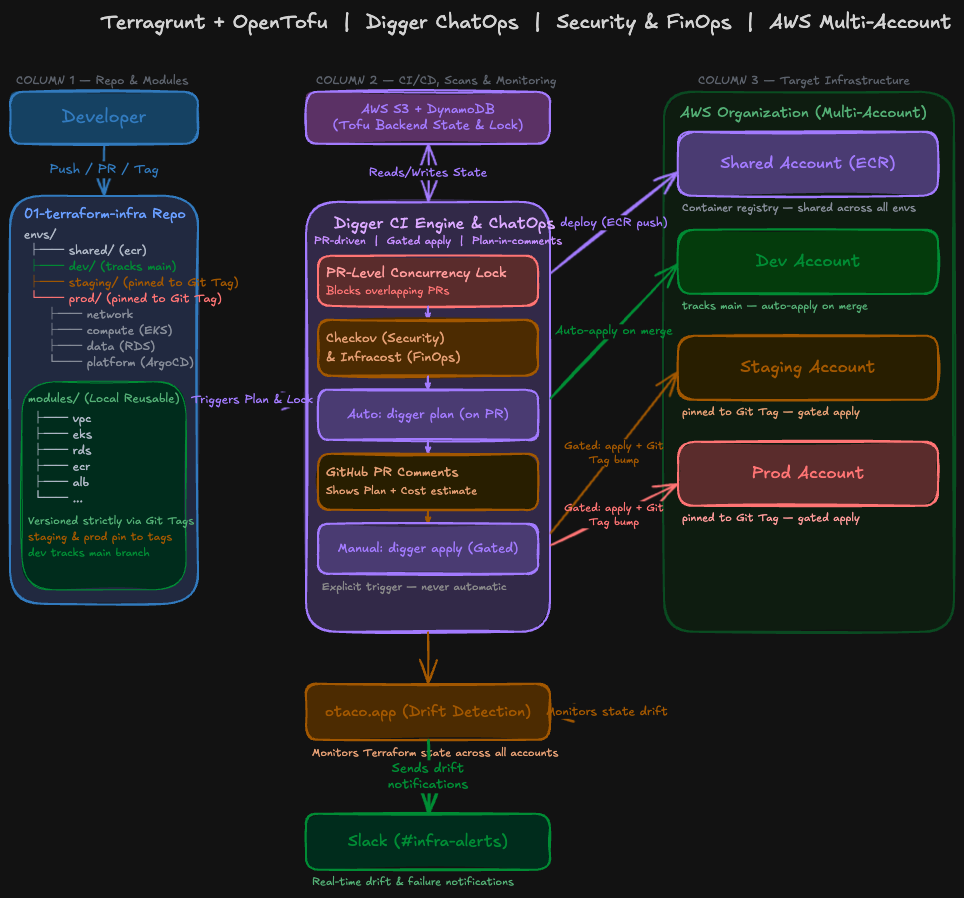
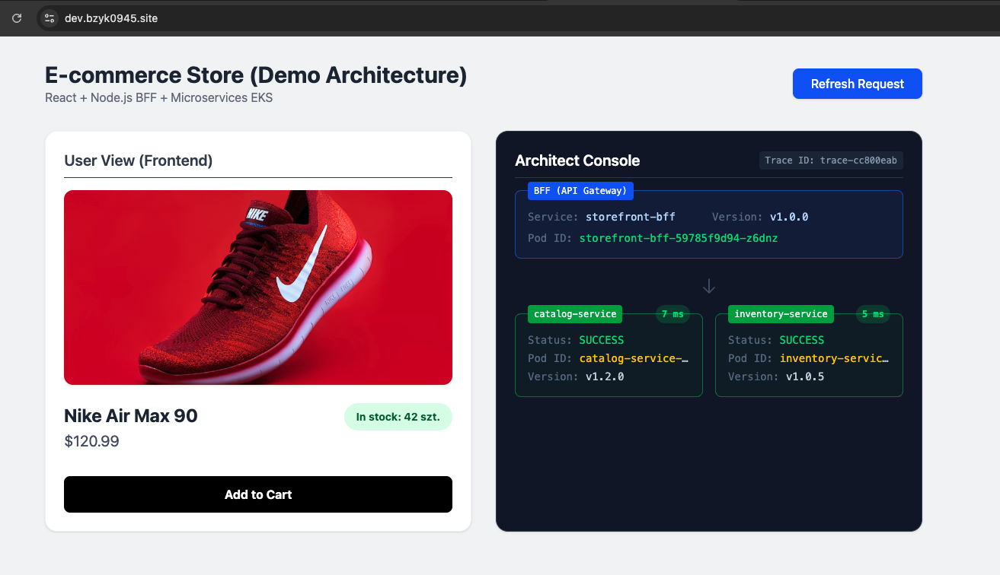
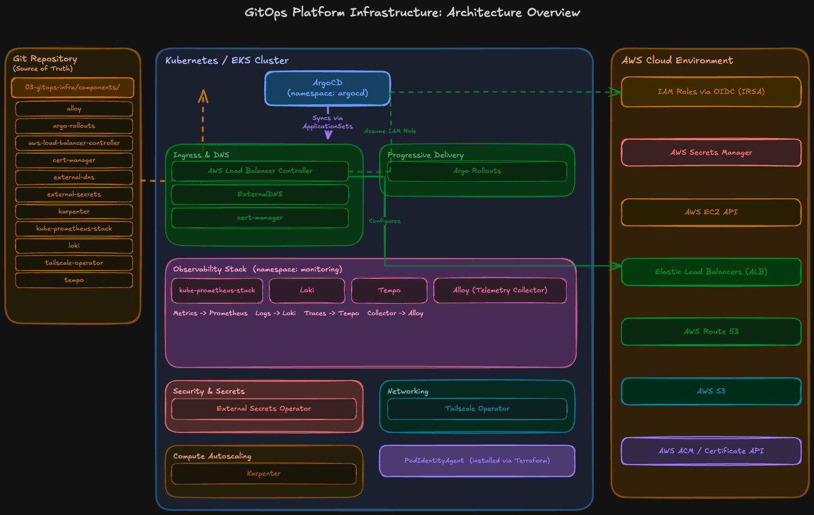
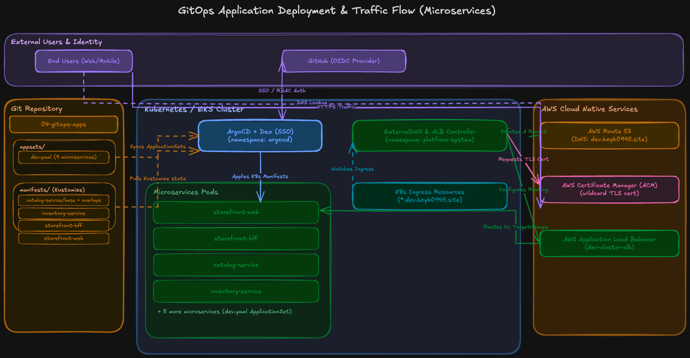

# ☁️ End-to-End Cloud Native & GitOps Platform

  
  
  
  
  

> 🚧 **Recruitment Note & Current Status (WIP)**
> This platform is a living project and is actively being developed. **The core architecture, GitOps pipeline, and `dev` environment are fully functional and live.** However, I decided to open-source this repository slightly early to share my progress for an ongoing recruitment process. 
> 
> **Next steps on my roadmap:**
> * Refactoring and DRY-ing up specific Terraform/Terragrunt modules.
> * Finalizing the deployment logic for the isolated `staging` and `prod` environments.
> * Implementing automated integration tests.

Hi there! Welcome to my DevOps portfolio project. As a Junior DevOps Engineer, I built this platform to demonstrate production-grade architecture, moving beyond tutorials to solve real-world problems like FinOps, Shift-Left Security, and Day-2 Operations.

## 📑 Table of Contents

* **[Part 1: Infrastructure as Code (OpenTofu & Terragrunt)](#part-1-infrastructure-as-code-opentofu--terragrunt)**
  * [1.1 Architecture Overview](#11-architecture-overview)
  * [1.2 How It Works (The Workflow)](#12-how-it-works-the-workflow)
  * [1.3 Infrastructure Design Decisions (Why this stack?)](#13-infrastructure-design-decisions-why-this-stack)
  * [1.4 Biggest Infrastructure Challenges](#14-biggest-infrastructure-challenges)
* **[Part 2: Application Source Code — 4 Microservices](#part-2-application-source-code--4-microservices)**
  * [2.1 Architecture Overview](#21-architecture-overview)
  * [2.3 Application Design Decisions](#23-application-design-decisions)
  * [2.4 Biggest Application Challenges](#24-biggest-application-challenges)
* **[Part 3: GitOps — Platform Infrastructure](#part-3-gitops--platform-infrastructure)**
  * [3.1 Architecture Overview](#31-architecture-overview)
* **[Part 4: GitOps — Application Deployment](#part-4-gitops--application-deployment)**
  * [4.1 Architecture Overview](#41-architecture-overview)

## Part 1: Infrastructure as Code (OpenTofu & Terragrunt)

This section covers the bedrock of the project: the cloud infrastructure. It details how AWS environments are provisioned from scratch using OpenTofu and Terragrunt. Before any application code can be deployed, this layer ensures that networks, databases, and Kubernetes clusters are securely up and running.

 

### 🗺️ 1.1 Architecture Overview

  

 

The infrastructure is split into logical layers with clear dependencies:

* **network** — VPC, subnets, NAT gateway
* **compute** — EKS cluster, node groups
* **data** — RDS instance
* **dns** — Route53 hosted zone, ACM certificate (dev)
* **platform** — ArgoCD, ExternalDNS, AWS Load Balancer Controller

Environment folders (`dev`, `staging`, `prod`, `shared`) live under `01-terraform-infra/envs/`. Each layer pulls its inputs from the parent `env.hcl` and, where needed, from dependency blocks that read outputs from sibling layers.

 

### 🚀 1.2 How It Works (The Workflow)

When I introduce a change to the infrastructure, I follow a Git-driven ChatOps workflow:

1. **Opening a Pull Request:** Pushing code triggers the Digger CI/CD pipeline.
2. **Shift-Left Security & FinOps:** Before any infrastructure is touched, the pipeline runs `Checkov` to scan for security misconfigurations. `Infracost` analyzes the code to estimate AWS cost impact. Both reports are posted in the PR comments.
3. **PR-Level Concurrency Locks:** Digger locks the specific environment and layer I'm working on, preventing race conditions and corrupted state if another team member opens a concurrent PR.
4. **Gated ChatOps Deployment:** To deploy changes to Staging or Production, merging the PR is not enough. I must explicitly type `digger apply` in the PR comments.

 

### 🤔 1.3 Infrastructure Design Decisions (Why this stack?)

* **Why OpenTofu instead of standard Terraform?**
  After HashiCorp changed Terraform's license to BSL and announced the end of the free HCP Terraform plan (shifting to per-resource pricing), I wanted to avoid vendor lock-in. By migrating to OpenTofu (a true open-source alternative), I keep costs close to zero while managing my own state backend using S3 for state locking.

* **Why Terragrunt?**
  To avoid copy-pasting EKS and VPC definitions across `dev`, `staging`, and `prod`, I used Terragrunt. The actual infrastructure logic lives in versioned, reusable modules (`modules/`), and environment folders (`envs/`) only contain the variables for that environment.

* **Why an AWS Multi-Account Strategy?**
  I separated `dev`, `staging`, and `prod` into isolated AWS accounts within an AWS Organization. This limits the **blast radius** of any failure. A `shared` account acts as a central hub for the ECR container registry.

* **Why Digger instead of standard GitHub Actions?**
  Standard CI/CD tools struggle with IaC state conflicts. Digger natively handles PR-level locks and provides a ChatOps experience, allowing me to control deployments via GitHub comments without giving GitHub direct administrative access to my AWS accounts.

 

### 🚧 1.4 Biggest Infrastructure Challenges

*  **1. Hitting the Limits of Raw GitHub Actions (Adopting Digger)**

At first, I built the CI/CD pipeline from scratch using native GitHub Actions. I wrote workflows with matrix strategies and path filters (`dorny/paths-filter`) to trigger specific Terraform layers. I used custom scripts (`actions/github-script`) to parse `terraform plan` output and format it into PR comments. It worked, but it became a maintenance burden. Handling state locks, queuing concurrent Pull Requests, and ensuring secure RBAC inside GitHub Actions was overly complex.

* **The Fix:** I replaced the complex YAML pipelines with **Digger**. Digger natively handles PR-level concurrency locks and ChatOps (running plans and applies via comments) out of the box, so I can focus on infrastructure rather than CI/CD boilerplate.

 

## Part 2: Application Source Code — 4 Microservices
The application layer lives in 02-app-source-code/ and consists of four distinct microservices written in different languages (Python, Go, and TypeScript). Deploying a polyglot architecture allowed me to practice standardizing containerization and CI processes across diverse tech stacks.

 

### 🗺️ 2.1 Architecture Overview

The application follows a Backend-for-Frontend (BFF) pattern:

* storefront-web (React, TypeScript, Node 24): The static frontend, served efficiently via Nginx.

* storefront-bff (Node 20, Express 5, TypeScript): The aggregator. Instead of the frontend making multiple API calls, it hits a single endpoint (/api/storefront/products/:id). The BFF fetches data from the downstream services and returns the product data, stock status, and custom metrics (like traceId, latency, and downstream status).

* catalog-service (Python 3.11, FastAPI): Manages product information.

* inventory-service (Go 1.26): Manages stock levels.

 

### 🤔 2.3 Application Design Decisions

* **Why use the BFF (Backend-for-Frontend) pattern?**  
In microservice architectures, letting the client talk directly to internal services creates tight coupling and security risks. The BFF acts as an API Gateway tailored for the UI, handling payload aggregation and injecting distributed tracing (`traceId`) so I can monitor latency across the stack.

* **Why Distroless and Scratch containers?**  
For the Go `inventory-service`, I statically compiled the binary (`CGO_ENABLED=0`) and placed it in a `scratch` (completely empty) image. For Python and Node, I used `alpine` or `slim` images, stripping out unnecessary OS packages. This reduces vulnerability scans (CVEs) to near zero.

* **Why explicit User IDs in Dockerfiles?**  
By creating an `appuser` (or using the built-in node user) and using `COPY --chown=appuser:appgroup`, I ensure Kubernetes Pod Security Standards can safely run these containers with `runAsNonRoot: true`.

 

### 🚧 2.4 Biggest Application Challenges

* **1.Multi-stage Python Builds without Root Privileges**
Python virtual environments (`venv`) and non-root users often clash during multi-stage Docker builds.

 

## Part 3: GitOps — Platform Infrastructure
This section covers the `03-gitops-infra/` repository. Once Terraform/OpenTofu provisions the raw AWS infrastructure (the EKS cluster, RDS, etc.), ArgoCD takes over. It declaratively installs all the essential cluster add-ons required to make the platform production-ready.

 

### 🗺️ 3.1 Architecture Overview

 

## Part 4: GitOps — Application Deployment
The final piece of the puzzle is `04-gitops-apps/`. This repository contains the Kubernetes manifests for the actual microservices. By splitting application code (Part 2) from application manifests (Part 4), I ensure clean, scalable GitOps practices.

 

### 🗺️ 4.1 Architecture Overview

  

 